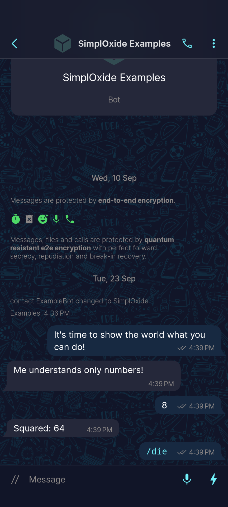

# simploxide-client

SimpleX-Chat bot API client

## 🤖Try out SimplOxide bots right now!

1. [Install Rust](https://www.rust-lang.org/learn/get-started) if you haven't already.
1. [Get SimpleX chat CLI](https://github.com/simplex-chat/simplex-chat/blob/stable/docs/CLI.md#%F0%9F%9A%80-installation)
1. Ensure that SimpleX Chat CLI is available globally: `simplex-chat --version`
1. Run the squaring bot:
   ```bash
   cargo run --example squaring_bot
   ```
   You can run any bot from [examples/](./examples) directory by changing the
   `--example` argument.
    1. Interact with the bot:

       

_Some examples require you to follow specific setup instructions, make sure you
read the top-level comments of an example to setup everything correctly._

----

Explore [bot sources](./examples) or read [crate
docs](https://docs.rs/simploxide-client/latest/simploxide_client/) to learn how
to write your own bots.
### LICENSE

#### DISCLAIMER

SIMPLEX CLI HAS AN OPEN WEBSOCKET API, AND IT CAN BE ACCESSED FROM ANY LIBRARY
OR APPLICATION, WHETHER OPEN-SOURCE OR NOT. THE SIMPLOXIDE LIBRARIES PROVIDE A
WEBSOCKET CLIENT AND API CODECS FOR SIMPLEX CLI THAT DON'T DEPEND ON ANY CODE
FROM THE SIMPLEX PROJECT AND THEREFORE ARE DUAL LICENSED UNDER APACHE-2.0/MIT
AS STATED BELOW. APACHE-2.0/MIT TERMS AND CONDITIONS ARE APPLICABLE TO YOUR
PROJECTS AS LONG AS THEY DON'T:

- SHIP SIMPLEX-CLI OR ANY OTHER SIMPLEX COMPONENTS AS PART OF AN APPLICATION
- USE FFI BINDINGS TO THE SIMPLEX-CORE OR OTHER SIMPLEX LIBRARIES
- DEPEND ON OR INCLUDE ANYTHING ELSE LICENSED UNDER AGPL

OTHERWISE, YOUR PROJECTS MUST ADHERE TO [SIMPLEX
AGPL-3.0](https://github.com/simplex-chat/simplex-chat/blob/stable/LICENSE).


THIS IS NOT A LEGAL ADVICE BUT RATHER A FRIENDLY REMAINDER.

SIMPLOXIDE LIBRARIES AUTHORS DISCLAIM ALL RESPONSIBILITY AND LIABILITY FOR ANY
FAILURE BY SIMPLOXIDE USERS TO COMPLY WITH THE AGPL-3.0.

---

Licensed under either of [Apache License, Version 2.0](../LICENSE-APACHE) or [MIT
license](../LICENSE-MIT) at your option.

Unless you explicitly state otherwise, any contribution intentionally submitted
for inclusion in this crate by you, as defined in the Apache-2.0 license, shall
be dual licensed as above, without any additional terms or conditions.
