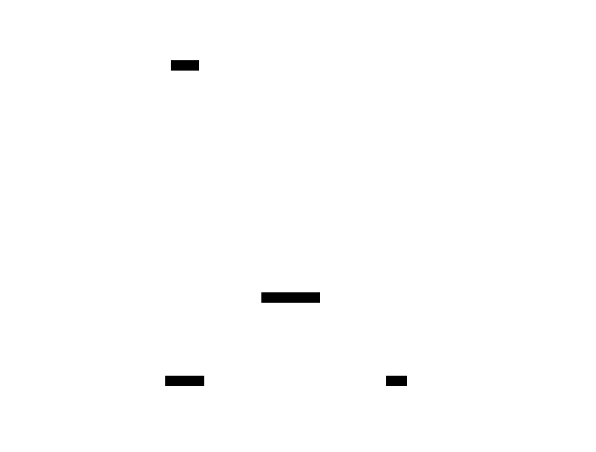
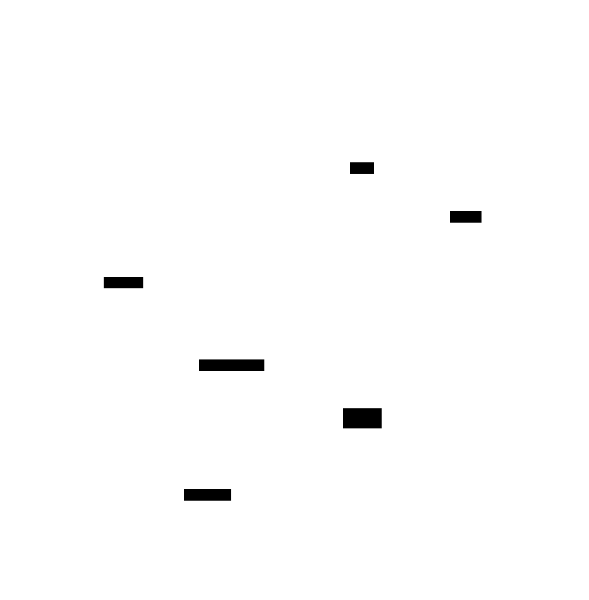
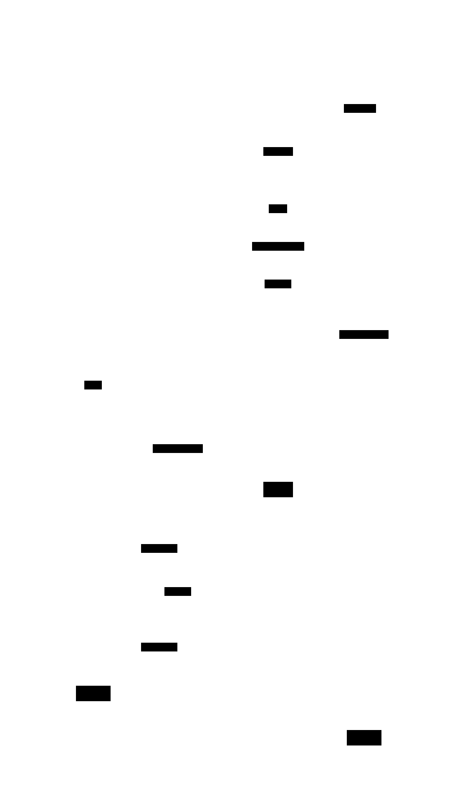
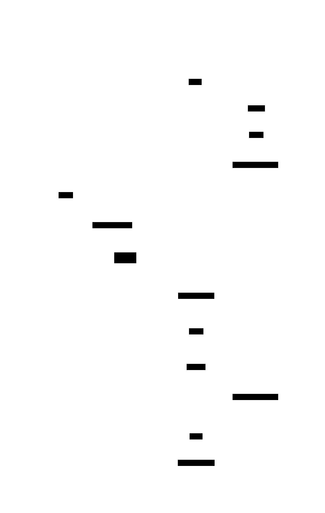

# simploxide-core

Provides a fully asynchronous client capable of sending raw SimpleX
requests(commands) and receiving raw responses(JSON objects).

See [docs](https://docs.rs/simploxide-core)

### Features

##### Complete asynchronisity:

Futures created by the same instance of a client are completely independent
from each other. The event queue receives events independently from client
actions.

##### Graceful shutdown:

All futures scheduled before the `.disconnect` call are guaranteed to receive
their responses. All futures scheduled after the `.disconnect` call are
guaranteed to receive the [`tungstenite::Error::AlreadyClosed`](#) error.

##### Graceful error handling:

If a web socket connection drops due to an error all already received(buffered)
responses are guaranteed to be delivered to corresponding futures. All other
pending futures are guaranteed to be resolved with the web socket error.

### LICENSE

#### DISCLAIMER

SIMPLEX CLI HAS AN OPEN WEBSOCKET API, AND IT CAN BE ACCESSED FROM ANY LIBRARY
OR APPLICATION, WHETHER OPEN-SOURCE OR NOT. THE SIMPLOXIDE LIBRARIES PROVIDE A
WEBSOCKET CLIENT AND API CODECS FOR SIMPLEX CLI THAT DON'T DEPEND ON ANY CODE
FROM THE SIMPLEX PROJECT AND THEREFORE ARE DUAL LICENSED UNDER APACHE-2.0/MIT
AS STATED BELOW. APACHE-2.0/MIT TERMS AND CONDITIONS ARE APPLICABLE TO YOUR
PROJECTS AS LONG AS THEY DON'T:

- SHIP SIMPLEX-CLI OR ANY OTHER SIMPLEX COMPONENTS AS PART OF AN APPLICATION
- USE FFI BINDINGS TO THE SIMPLEX-CORE OR OTHER SIMPLEX LIBRARIES
- DEPEND ON OR INCLUDE ANYTHING ELSE LICENSED UNDER AGPL

OTHERWISE, YOUR PROJECTS MUST ADHERE TO [SIMPLEX
AGPL-3.0](https://github.com/simplex-chat/simplex-chat/blob/stable/LICENSE).

THIS IS NOT A LEGAL ADVICE BUT RATHER A FRIENDLY REMAINDER.

SIMPLOXIDE LIBRARIES AUTHORS DISCLAIM ALL RESPONSIBILITY AND LIABILITY FOR ANY
FAILURE BY SIMPLOXIDE USERS TO COMPLY WITH THE AGPL-3.0.

---

Licensed under either of [Apache License, Version 2.0](../LICENSE-APACHE) or [MIT
license](../LICENSE-MIT) at your option.

Unless you explicitly state otherwise, any contribution intentionally submitted
for inclusion in this crate by you, as defined in the Apache-2.0 license, shall
be dual licensed as above, without any additional terms or conditions.

